# 模块系统状态

## 模块定义

为了以一种既可供开发人员使用又可由现有工具链支持的方式提供可靠的配置和强大的封装，我们将模块视为一种基本的新型Java程序组件。 模块是一个命名的，自描述的代码和数据集合。 它的代码被组织为一组包含类型的包，即Java类和接口; 其数据包括资源和其他类型的静态信息。

### 模块声明

模块的自描述在其模块声明中表示，模块声明是Java编程语言的新结构。 最简单的模块声明仅指定其模块的名称：

```java
module com.foo.bar { }
```

可以添加一个或多个require子句，以声明模块在编译时和运行时依赖于某些其他模块：

```java
module com.foo.bar {
    requires org.baz.qux;
}
```

最后，可以添加exports子句以声明该模块使所有特定包中的public类型可供其他模块使用：

```java
module com.foo.bar {
    requires org.baz.qux;
    exports com.foo.bar.alpha;
    exports com.foo.bar.beta;
}
```

如果模块的声明不包含exports子句，则它不会将任何类型导出到任何其他模块。

按照惯例，模块声明的源代码放在模块源文件层次结构根目录下的名为module-info.java的文件中。 com.foo.bar模块的源文件，例如，可能包括：

```java
module-info.java
com/foo/bar/alpha/AlphaFactory.java
com/foo/bar/alpha/Alpha.java
...
```

按照惯例，模块声明被编译到名为module-info.class的文件中，跟其他.class文件一样放在class-file output目录中。

模块名,像包名一样不得冲突。模块命名的推荐方法是使用类似包命名的反向域名模式。 因此，模块的名称通常是其导出的包的名称的前缀，但这种关系不是必需的。

模块的声明不包含版本字符串，也不包括它所依赖的模块的版本字符串的约束。 这是故意的：模块系统的目标不是解决版本选择问题，最好留给构建工具和容器应用程序。

由于多种原因，模块声明是Java编程语言的一部分，而不是它们自己的语言或符号。 其中最重要的一点是模块信息必须在编译时和运行时都可用，以实现跨阶段的保真度，即确保模块系统在编译时和运行时以相同的方式工作。 反过来，这可以防止多种错误，或者至少在编译时更早地报告 - 当它们更容易诊断和修复时。

在源文件中表达模块声明，将其与模块中的其他源文件一起编译到.class文件中以供Java虚拟机使用，这是建立保真度的方式。开发人员会立即熟悉这种方法，而IDE和构建工具也不难以支持。特别是，IDE可以通过合成组件项目描述中已有的信息中的requires子句来建议现有组件的初始模块声明。

### 模块工件

现有工具已经可以创建，操作和使用JAR文件，因此为了便于使用和迁移，我们定义了模块化JAR文件。 模块化JAR文件类似于普通的JAR文件，它根目录中多了一个module-info.class文件。 上述com.foo.bar模块的模块化JAR文件，例如，可能包含以下内容：

```shell
META-INF/
META-INF/MANIFEST.MF
module-info.class
com/foo/bar/alpha/AlphaFactory.class
com/foo/bar/alpha/Alpha.class
...
```

模块JAR文件可以用作模块，在这种情况下，其module-info.class文件用于其所包含的模块的声明; 或者，它可以放在普通的class path上，在这种情况下，它的module-info.class文件将被忽略。 模块化JAR文件允许库的维护者在所有版本上发布单个工件，该工件既可作为模块，也可作为在Java SE 9及更高版本中,classpath上的常规JAR文件。 我们希望包含jar工具的Java SE 9实现将增强该工具，以便轻松创建模块化JAR文件。

JDK为了模块化Java SE平台的参考实现，我们将引入一种超出JAR文件的新工件格式，以适应native代码，配置文件以及其他不适合的数据，如果有的话，进入JAR文件。此格式利用了在源文件中表达模块声明并将其编译为类文件的另一个优点，即该类文件独立于任何特定的工件格式。这种新格式（临时命名为“JMOD”）是否应该标准化是一个悬而未决的问题。

### 模块描述符

将模块声明编译到类文件中的最后一个优点是类文件已经具有精确定义和可扩展的格式。 因此，我们可以更普遍地考虑module-info.class文件，作为模块描述符，其中包括源级模块声明的编译形式，还包括记录在类声明属性中的其他类型的信息，这些信息在声明最初之后插入编译。

IDE或构建时打包工具可以插入包含文档信息的属性，例如模块的版本，标题，描述和许可。可以通过模块系统的反射工具在编译时和运行时读取此信息，以用于文档，诊断和调试。它也可以由下游工具用于构建特定于操作系统的包工件。一组特定的属性将被标准化，但由于Java类文件格式是可扩展的，因此其他工具和框架将能够根据需要定义其他属性。非标准属性不会影响模块系统本身的行为。

### 平台模块

Java SE 9平台规范将使用模块系统将平台划分为一组模块。 Java SE 9平台的实现可能包含所有平台模块，或者可能只包含其中的一些。

在任何情况下，模块系统明确知道的唯一模块是base模块，名为java.base。 base模块定义并导出所有平台的核心包，包括模块系统本身：

```java
module java.base {
    exports java.io;
    exports java.lang;
    exports java.lang.annotation;
    exports java.lang.invoke;
    exports java.lang.module;
    exports java.lang.ref;
    exports java.lang.reflect;
    exports java.math;
    exports java.net;
    ...
}
```

base模块始终存在。 每个其他模块隐含地依赖于base模块，而base模块不依赖于其他模块。

其余的平台模块将共享“java.”名称前缀，并且可能包括例如用于数据库连接的java.sql，用于XML处理的java.xml和用于日志记录的java.logging。 根据惯例，未在Java SE 9平台规范中定义但是特定于JDK的模块将共享“jdk.”名称前缀。

## 使用模块

单个模块可以在模块工件中定义，也可以内置到编译时或运行时环境中。 为了在任一阶段使用它们，模块系统必须定位它们，然后确定它们彼此之间的关系，以便提供可靠的配置和强大的封装。

### 模块路径(module path)

为了定位工件中定义的模块，模块系统搜索由主机系统定义的模块路径。 模块路径是一个序列，其中每个元素都是模块工件或包含模块工件的目录。 对于定义合适模块的第一个工件，按顺序搜索模块路径的元素。

module path与class path实质上不同，并且更加健壮。class path的固有脆弱性是由于它是在路径上的所有工件中定位各个类型的手段，在工件本身之间没有区别。这使得无法预先告知何时缺少工件。它还允许不同的工件在同一个包中定义相同类型，即使这些工件代表同一逻辑程序组件的不同版本，或完全不同的组件.

相反，module path是一种定位整个模块而不是单个类型的方法。如果模块系统无法满足与模块路径中的工件的特定依赖关系，或者如果它在同一目录中遇到定义同名模块的两个工件，则编译器或虚拟机将报告错误并退出。

内置于编译时或运行时环境的模块以及module path上的工件定义的模块统称为可观察模块的范围.

### 解析度

假设我们有一个应用程序使用上面的com.foo.bar模块以及平台的java.sql模块。 包含应用程序核心的模块声明如下：

```java
module com.foo.app {
    requires com.foo.bar;
    requires java.sql;
}
```

给定这个初始应用程序模块，模块系统通过定位附加的可观察模块来解决其require选项中表达的依赖关系，以解决这些依赖关系，然后解决这些模块的依赖关系，等等，直到满足每个模块的每个依赖关系。 这种传递闭包计算的结果是模块图，对于具有由某个其他模块满足的依赖性的每个模块，该模块图包含从第一模块到第二模块的有向边。

为了构造com.foo.app模块的模块图，模块系统检查java.sql模块的声明，即：

```java
module java.sql {
    requires java.logging;
    requires java.xml;
    exports java.sql;
    exports javax.sql;
    exports javax.transaction.xa;
}
```

它还检查了上面已经显示的com.foo.bar模块的声明，以及org.baz.qux，java.logging和java.xml模块的声明。 为简洁起见，这里没有显示这三个，因为它们没有声明对任何其他模块的依赖。

基于所有这些模块声明，为com.foo.app模块计算的图包含以下节点和边：

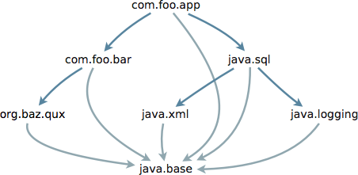

在该图中，深蓝色线表示显式依赖关系，如require子句中所表示，而浅蓝色线表示每个模块对基本模块的隐式依赖性

### 可读性

当一个模块直接依赖于模块图中的另一个模块时，第一个模块中的代码将能够引用第二个模块中的类型。 因此，我们说第一个模块读取第二个模块，或者等效地说，第二个模块可以读取第一个模块。 因此，在上图中，com.foo.app模块读取com.foo.bar和java.sql模块，但不读取org.baz.qux，java.xml或java.logging模块。 java.slog模块可以被java.sql模块读取，但没有其他模块可读。 （根据定义，每个模块都会自行读取。）

模块图中定义的可读性关系是可靠配置的基础：模块系统确保每个依赖性都由另一个模块实现，模块图是非循环的，每个模块最多读取一个定义给定的模块，并且定义具有相同名称的包的模块不会相互干扰。

可靠的配置不仅更可靠;它也可以更快。当模块中的代码引用包中的类型时，保证该包在该模块中或在该模块读取的模块中定义。因此，在寻找特定类型的定义时，不需要在多个模块中搜索它，或者更糟糕地在整个class path中搜索它。

### 无障碍

模块图中定义的可读性关系与模块声明中的exports子句相结合，是强封装的基础：Java编译器和虚拟机认为一个模块中的包中的public类型可以通过其他模块中的代码访问只有当第一个模块可被第二个模块读取时，在上面定义的意义上，第一个模块才会导出该包。 也就是说，如果在不同的模块中定义了两个类型S和T，并且T是public的，那么S中的代码可以访问T，如果：

- S的模块读取T的模块，和
- T的模块export T的包。

无法访问的边界模块引用的类型不可用，就像私有方法或字段不可用一样：任何使用它的尝试都会导致编译器报告错误，或者抛出IllegalAccessError 由Java虚拟机或反射运行时API抛出的IllegalAccessException。 因此，即使将类型声明为public，如果其包未在其模块的声明中export，那么它只能被该模块中的代码访问。

如果在这种意义上可以访问其封闭类型，并且成员本身的声明也允许访问，则可以访问跨模块边界引用的方法或字段。

为了了解上述模块图中封装的强大功能，我们使用它导出的包标记每个模块：

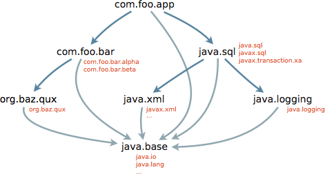

com.foo.app模块中的代码可以访问com.foo.bar.alpha包中声明的公共类型，因为com.foo.app依赖于com.foo.bar模块，因为com.foo.bar导出com.foo.bar.alpha包,因此读取com.foo.bar模块。 如果com.foo.bar包含内部包com.foo.bar.internal，则com.foo.app中的代码无法访问该包中的任何类型，因为com.foo.bar不会将其导出。 com.foo.app中的代码不能引用org.baz.qux包中的类型，因为com.foo.app不依赖于org.baz.qux模块，因此不会读取它。

### 隐含的可读性

如果一个模块读取另一个模块，那么在某些情况下，它应该在逻辑上也读取其他模块。

例如，平台的java.sql模块，依赖于java.logging和java.xml模块，不仅因为它包含在这些模块中使用类型的实现代码，还因为它定义了签名,引用这些模块中的类型。 特别是java.sql.Driver接口声明了public方法`public Logger getParentLogger()` 其中Logger是在java.logging模块的export的java.util.logging包中声明的类型。

例如，假设com.foo.app模块中的代码调用此方法以获取Logger，然后记录消息：

```java
String url = ...;
Properties props = ...;
Driver d = DriverManager.getDriver(url);
Connection c = d.connect(url, props);
d.getParentLogger().info("Connection acquired");
```

如果com.foo.app模块如上所述声明，那么这将不起作用:getParentLogger方法返回一个Logger，它是java.logging模块中声明的类型，com.foo.app模块无法读取，因此，Logger类中的info方法的调用将在编译时和运行时都失败，因为该类以及该方法是不可访问的。

这个问题的一个解决方案是希望每个模块的每个作者都依赖于java.sql模块并包含使用getParentLogger方法返回的Logger对象的代码，也要记住声明对java.logging模块的依赖。当然，这种方法是不可靠的，因为它违反了一个原则：如果一个模块依赖于第二个模块，那么很自然地期望第一个模块可以使用每个类型，即使类型是在第二个模块中定义的，将立即访问仅依赖于第一个模块的模块访问。

因此，我们扩展模块声明，以便一个模块可以向依赖于它的任何模块授予其依赖的附加模块的可读性。通过在require子句中包含public修饰符来表示这种隐含的可读性。 java.sql模块的声明实际上是：

```java
module java.sql {
    requires public java.logging;
    requires public java.xml;
    exports java.sql;
    exports javax.sql;
    exports javax.transaction.xa;
}
```

public修饰符意味着依赖于java.sql模块的任何模块不仅会读取java.sql模块，还会读取java.logging和java.xml模块。 com.foo.app模块的模块图如上所示，因此包含两个额外的深蓝色边缘，由绿色边缘链接到java.sql模块，因为它们是由该模块隐含的：


com.foo.app模块现在可以包含访问java.logging和java.xml模块的导出包中的所有public类型的代码，即使它的声明没有提到这些模块。

通常，如果一个模块export包含其签名引用第二个模块中的包的类型的包，则第一个模块的声明应该包括requires public 依赖于第二个模块。 这将确保依赖于第一个模块的其他模块将自动读取第二个模块，从而访问该模块的导出包中的所有类型。

## 兼容性和迁移

到目前为止，我们已经了解了如何从头开始定义模块，将它们打包成模块工件，并将它们与其他模块一起使用，这些模块既可以内置到平台中，也可以在工件中定义。

当然，大多数Java代码是在引入模块系统之前编写的，并且必须像今天一样继续工作，而不做任何更改。 因此，即使平台本身由模块组成，模块系统也可以在classpath上编译和运行由JAR文件组成的应用程序。 它还允许以灵活和渐进的方式将现有应用程序迁移到模块化形式。

### 未命名模块

如果请求加载其包未在任何已知模块中定义的类型，则模块系统将尝试从classpath加载它。 如果成功，则该类型被认为是称为未命名模块的特殊模块的成员，以确保每个类型与某个模块相关联。 未命名的模块在很高的层次上类似于现有概念的[未命名包](http://docs.oracle.com/javase/specs/jls/se8/html/jls-7.html#jls-7.4.2)。 当然，所有其他模块都有名称，因此我们今后将其称为命名模块。

未命名的模块读取其他每个模块。 因此，从classpath加载的任何类型的代码都将能够访问所有其他可读模块的导出类型，默认情况下，这些模块将包括所有已命名的内置平台模块。 因此，在Java SE 8上编译和运行的现有classpath应用程序将在Java SE 9上以完全相同的方式进行编译和运行，只要它仅使用标准的，不推荐使用的Java SE API即可。

未命名的模块export其所有包。 这可以实现灵活的迁移，我们将在下面看到。 但是，它并不意味着命名模块中的代码可以访问未命名模块中的类型。 事实上，命名模块甚至不能声明对未命名模块的依赖。 这种限制是有意的，因为允许命名模块依赖于类路径的任意内容将使得不可能进行可靠的配置。

如果在命名模块和未命名模块中都定义了相同的包，则忽略未命名模块中的包。 即使面对classpath的混乱，这仍然保留了可靠的配置，确保每个模块仍然最多只读取一个定义给定包的模块。 如果在上面的示例中，classpath上的普通JAR文件包含名为com/foo/bar/alpha/AlphaFactory.class的类文件，那么将永远不会加载该文件，因为com.foo.bar.alpha包已通过com.foo.bar模块export。

### 自下而上的迁移

将从classpath加载的类型作为未命名模块的成员处理，允许我们以增量式，自下而上的方式将现有应用程序的组件从JAR文件迁移到模块。

例如，假设上面显示的应用程序最初是为Java SE 8构建的，作为一组放在classpath上的类似命名的JAR文件。 如果我们在Java SE 9上按原样运行它，那么JAR文件中的类型将在未命名的模块中定义。 该模块将读取所有其他模块，包括所有内置平台模块; 为简单起见，假设它们仅限于前面显示的java.sql，java.xml，java.logging和java.base模块。 因此我们获得了模块图

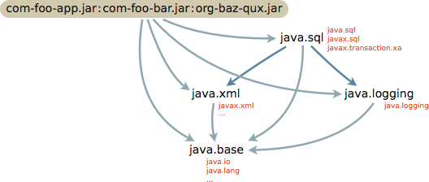

我们可以立即将org-baz-qux.jar转换为命名模块，因为我们知道它不引用其他两个JAR文件中的任何类型，因此作为命名模块，它不会引用任何类型留在未命名的模块中。 （我们碰巧从原始示例中了解到这一点，但如果我们还不知道它，那么我们可以借助jdeps这样的工具来发现它。）我们为org.baz.qux编写模块声明，将其添加到模块的源码中，编译它，并将结果打包为模块化JAR文件。 然后，如果我们将JAR文件放在模块路径上并将其他文件保留在classpath上，我们将获得改进的模块图

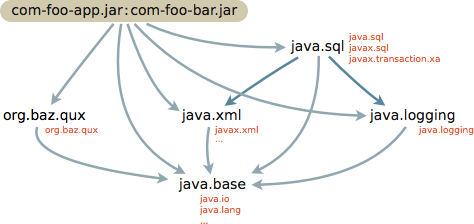

com-foo-bar.jar和com-foo-app.jar中的代码继续工作，因为未命名的模块读取每个命名模块，现在包含新的org.baz.qux模块。

我们可以类似地进行模块化com-foo-bar.jar，然后是com-foo-app.jar，最终结束预期的模块图，如前所示：

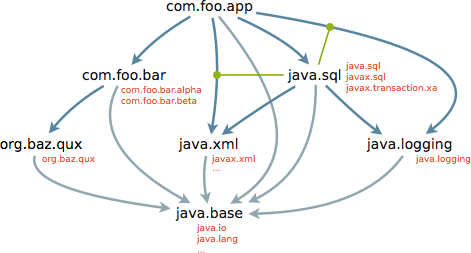

从图中可以看出我们对原始JAR文件中的类型所做的工作，当然，我们可以在一个步骤中模块化它们中的所有三个。 但是，如果org-baz-qux.jar是由一个完全不同的团队或组织独立维护的，那么它可以在其他两个组件之前进行模块化，同样com-foo-bar.jar可以在com.foo-app.jar模块化之前进行模块化。

### 自动模块化

自下而上的迁移很简单，但并不总是可行的。 即使org-baz-qux.jar的维护者尚未将其转换为适当的模块 - 或者也许永远不会 - 我们仍然可能希望模块化我们的com-foo-app.jar和com-foo-bar.jar组件。

我们已经知道com-foo-bar.jar中的代码引用了org-baz-qux.jar中的类型。 如果我们将com-foo-bar.jar转换为命名模块com.foo.bar但是在classpath上保留org-baz-qux.jar，那么该代码将不再起作用：org-baz-qux中的类型 .jar将继续在未命名的模块中定义，但com.foo.bar是一个命名模块，不能声明对未命名模块的依赖.

然后，我们必须以某种方式安排org-baz-qux.jar作为命名模块出现，以便com.foo.bar可以依赖它。 我们可以fork org.baz.qux的源代码并自己模块化，但如果维护者不愿意将该更改合并到上游存储库中，那么只要我们需要它就必须维护fork。

相反，我们可以将org-baz-qux.jar作为自动模块处理，方法是将其未经修改地放在模块路径而不是类路径上。 这将定义一个可观察的模块，其名称org.baz.qux是从JAR文件的名称衍生的，因此其他非自动模块可以一般的方式依赖它：

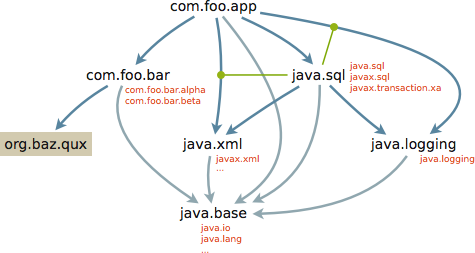

自动模块是一个隐式定义的命名模块，因为它没有模块声明。 相反，一个普通的命名模块是用模块声明明确定义的; 我们今后将把它们称为明确的模块。

事先没有实际的方法可以告诉自动模块可能依赖哪些其他模块。 因此，在解析模块图之后，会使自动模块读取其他所有命名模块，无论是自动还是显式：

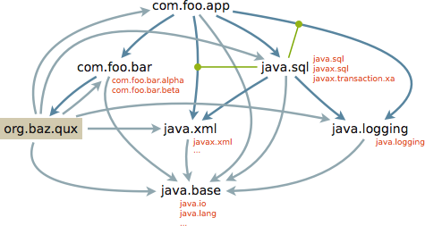

（这些新的可读性连接线确实在模块图中创建了循环，这使得它更难以推理，但我们认为这些是允许更灵活的迁移的可容忍的，通常是临时的结果。）

类似地，没有实际的方法来判断自动模块中的哪些包是供其他模块使用的，还是仍然在classpath上的类。 因此，即使实际上仅用于内部使用，也认为自动模块中的每个包都被导出：

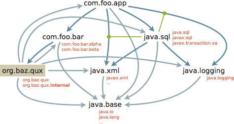

最后，没有实际的方法来判断自动模块中的某个导出包是否包含其签名(是指某些其他自动模块中定义的类型)。 例如，如果我们首先模块化com.foo.app，并将com.foo.bar和org.baz.qux都视为自动模块，那么我们就有了图形

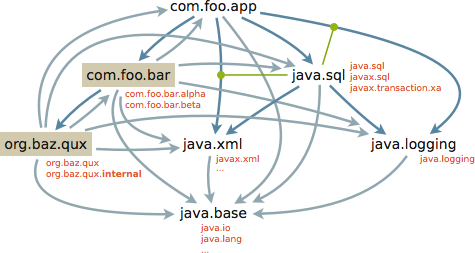

如果不读取两个相应JAR文件中的所有类文件，就不可能知道com.foo.bar中的public类型是否声明了一个返回类型在org.baz.qux中定义的public方法。 因此，自动模块为所有其他自动模块提供隐含的可读性：

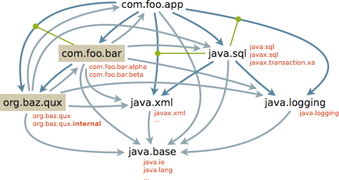

现在com.foo.app中的代码可以访问org.baz.qux中的类型，虽然我们知道它实际上并没有这样做。

自动模块在classpath的混乱和显式模块的规则之间提供了中间地带。 它们允许将由JAR文件组成的现有应用程序从上到下迁移到模块，如上所示，或者自上而下和自下而上的方法组合。 通常，我们可以从classpath上的任意一组JAR文件组件开始，使用jdeps等工具来分析它们的相互依赖性，将我们控制的源代码组件转换为显式模块，然后将它们与模块路径上的剩余JAR文件放在一起。 我们不控制其源代码的组件的JAR文件将被视为自动模块，直到它们也被转换为显式模块。

### 桥接到classpath

许多现有的JAR文件可以用作自动模块，但有些不能。 如果classpath上的两个或多个JAR文件包含同一个包中的类型，那么它们中的至多一个可以用作自动模块，因为模块系统仍然保证每个命名模块最多读取一个定义给定包的命名模块并且定义具有相同名称的包的命名模块不会相互干扰。 在这种情况下，经常会发现实际上只需要一个JAR文件。 如果其他是重复或近似重复，以某种方式错误地放在classpath上，则可以将其中一个用作自动模块，其他可以丢弃。 但是，如果classpath上的多个JAR文件故意有相同的包，那么在classpath上它们必须保留。

为了实现迁移，即使某些JAR文件不能用作自动模块，我们也可以使自动模块充当显式模块中的代码与仍然在classpath上的代码之间的桥梁：除了读取每个其他命名模块之外，还会创建一个自动模块读取未命名的模块。 如果我们的应用程序的原始类路径，例如，还包含JAR文件org-baz-fiz.jar和org-baz-fuz.jar，那么我们将得到图形如果我们的应用程序的原始类路径还包含JAR文件,例如org-baz-fiz.jar和org-baz-fuz.jar，那么我们将得到图形

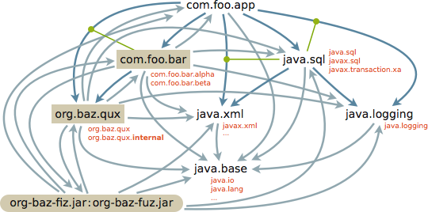

如前所述，未命名模块导出其所有包，因此自动模块中的代码将能够访问从classpath加载的任何公共类型。

使用classpath中的类型的自动模块不得将这些类型公开给依赖它的显式模块，因为显式模块不能声明对未命名模块的依赖。例如，如果显式模块com.foo.app中的代码引用com.foo.bar中的public类型，并且该类型的签名引用是在classpath上的一个JAR文件中的类型，那么代码在com.foo.app中将无法访问该类型，因为com.foo.app不能依赖于未命名的模块。 这可以通过临时将com.foo.app视为自动模块来解决，以便其代码可以从classpath访问类型，直到classpath上的相关JAR文件可以被视为自动模块或转换为进入一个明确的模块。

